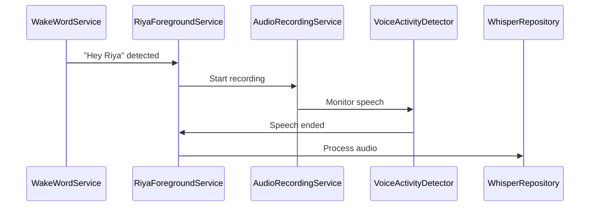
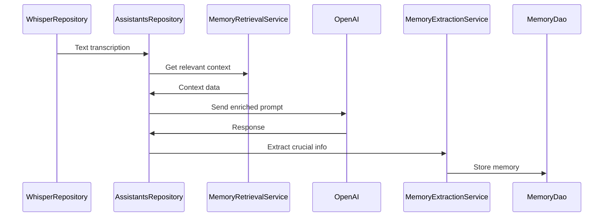
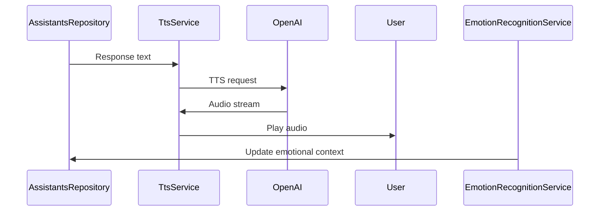
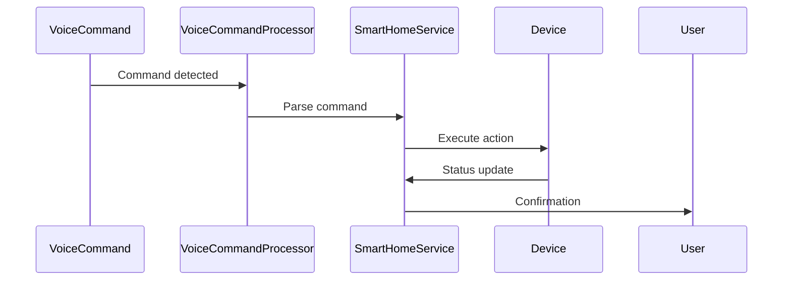

# Riya - Data Flow Documentation

## Core Interaction Flow

### 1. Wake Word Detection → Voice Input

### 2. Voice Processing → Response Generation

### 3. Response → User Interaction

## Memory System Flow

### Memory Creation

1. **Extraction**

   - Input: Conversation text
   - Process: GPT analysis
   - Output: Structured memory entities

2. **Storage**
   - Local: Room Database
   - Categories: Facts, Preferences, Habits
   - Priority: Importance-based (1-5)

### Memory Retrieval

1. **Context Building**

   - Input: Current conversation
   - Process: Relevance matching
   - Output: Contextual summary

2. **Usage**
   - Conversation enrichment
   - Response personalization
   - Behavioral adaptation

## Vision System Flow

### Camera Processing

1. **Input Sources**

   - Front camera: User emotion
   - Back camera: Environment

2. **Analysis Pipeline**

   - Frame capture
   - GPT-4 Vision analysis
   - Context integration

3. **Usage**
   - Emotional adaptation
   - Visual understanding
   - Environmental awareness

## System Integration

### Smart Home Control

### System Monitoring

1. **Metrics Collection**

   - Battery status
   - Network state
   - Device health

2. **Usage**
   - Resource optimization
   - User notifications
   - Performance tuning
