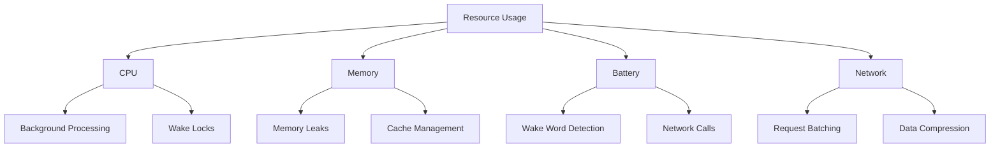

# Performance Optimization Guide

## Core Principles

### 1. Resource Management



## Battery Optimization

### 1. Wake Word Detection

- Custom threshold adjustment
- Adaptive sampling rate
- Power-efficient audio processing

```kotlin
class PowerConfig {
    val samplingRate: Int = when (batteryLevel) {
        in 0..15 -> 8000  // Low power mode
        in 15..50 -> 16000 // Normal mode
        else -> 22050     // High quality mode
    }
}
```

### 2. Network Operations

- Request batching
- Compression
- Caching strategy

```kotlin
interface NetworkOptimizer {
    fun batchRequests(requests: List<Request>)
    fun compressData(data: ByteArray): ByteArray
    fun shouldUseCachedResponse(request: Request): Boolean
}
```

## Memory Management

### 1. Cache Management

```kotlin
object CacheConfig {
    const val MAX_MEMORY_CACHE = 50 * 1024 * 1024 // 50MB
    const val MAX_DISK_CACHE = 250 * 1024 * 1024  // 250MB
    const val CACHE_EXPIRY = 24 * 60 * 60 * 1000L // 24 hours
}
```

### 2. Memory Leaks Prevention

- View lifecycle management
- Coroutine scope management
- Service cleanup
- Bitmap recycling

## CPU Optimization

### 1. Background Processing

```kotlin
class ProcessingConfig {
    val threadPoolSize = Runtime.getRuntime().availableProcessors()
    val backgroundDispatcher = Dispatchers.Default
    val ioDispatcher = Dispatchers.IO
}
```

### 2. Task Scheduling

- Priority queuing
- Deferred processing
- Batch operations

## Network Optimization

### 1. Request Management

```kotlin
interface RequestOptimizer {
    fun prioritizeRequest(request: Request): Priority
    fun canBeBatched(request: Request): Boolean
    fun shouldCache(response: Response): Boolean
}

enum class Priority {
    IMMEDIATE,
    HIGH,
    NORMAL,
    LOW,
    BACKGROUND
}
```

### 2. Data Transfer

- Compression
- Caching
- Connection pooling

## Monitoring & Profiling

### 1. Performance Metrics

```kotlin
data class PerformanceMetrics(
    val cpuUsage: Float,
    val memoryUsage: Long,
    val batteryDrain: Float,
    val networkUsage: Long,
    val responseTime: Long
)
```

### 2. Thresholds

```kotlin
object PerformanceThresholds {
    const val MAX_CPU_USAGE = 15f // percentage
    const val MAX_MEMORY = 200L * 1024 * 1024 // 200MB
    const val MAX_BATTERY_DRAIN = 5f // percentage per hour
    const val MAX_RESPONSE_TIME = 2000L // milliseconds
}
```

## Optimization Strategies

### 1. Wake Word Detection

- Adaptive sampling rates
- Energy-based detection
- Hardware acceleration

### 2. Voice Processing

- Batch processing
- Compression
- Caching

### 3. Vision Processing

- Frame skipping
- Resolution adaptation
- ROI processing

### 4. Memory System

- LRU caching
- Importance-based retention
- Periodic cleanup

## Best Practices

### 1. Resource Usage

- Release unused resources
- Minimize wake locks
- Batch operations
- Cache appropriately

### 2. Background Processing

- Use WorkManager
- Defer non-critical tasks
- Respect battery status
- Handle process death

### 3. Network Operations

- Request batching
- Response caching
- Connection pooling
- Compression

### 4. UI Performance

- Avoid overdraw
- Optimize layouts
- Recycle views
- Efficient rendering
